# TMS Pro — Complete Workflow Guide (All Scenarios)

Transport Management System covering booking → LR → trip → delivery → billing → accounting → HR → payroll.

---

## 1. System Actors & Entry Points

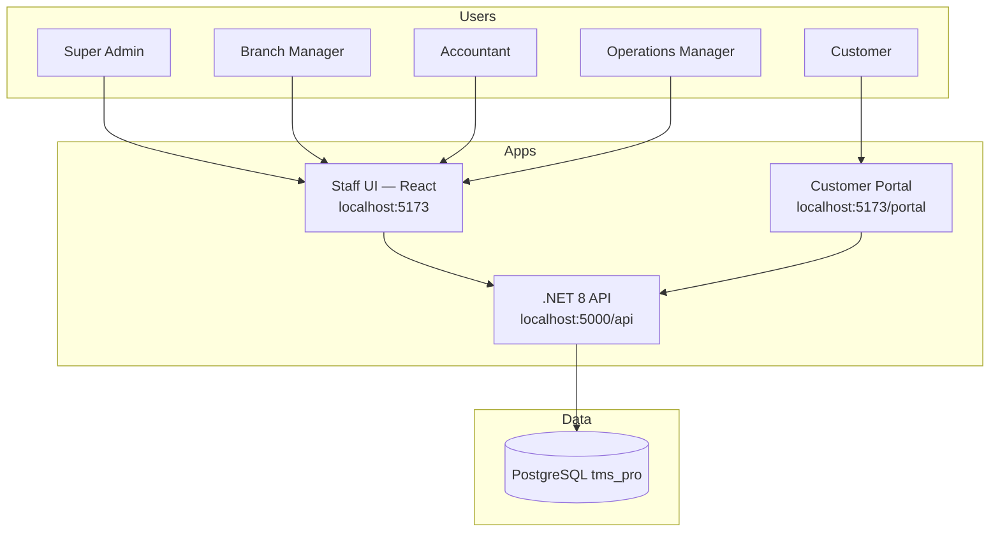

| Actor | Login | Default access |
|-------|--------|----------------|
| Super Admin | `/login` → `admin` / `admin123` | All branches, all modules |
| Branch Manager | `/login` | Own branch data only |
| Accountant | `/login` | Accounting, reports, payroll |
| Operations | `/login` | Bookings, LR, fleet, GPS, trips |
| Customer | `/portal/login` | Track shipments, invoices, POD |

---

## 2. Authentication Workflows

### 2.1 Staff Login

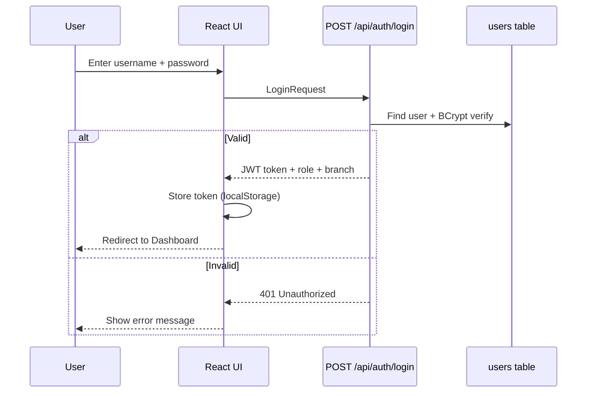

### 2.2 Customer Portal Login

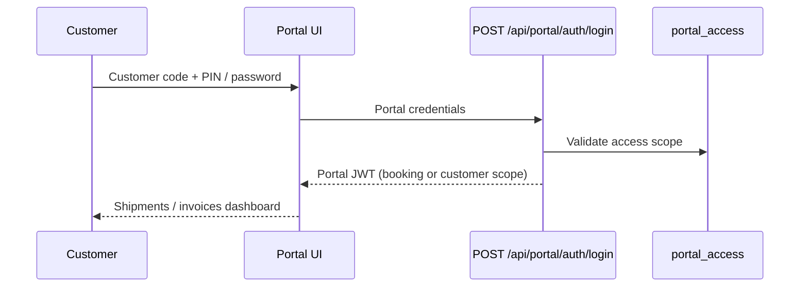

### 2.3 Public Tracking (no login)

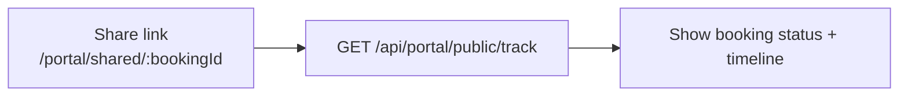

---

## 3. Core Transport Workflow (End-to-End)

Primary business path from enquiry to payment.

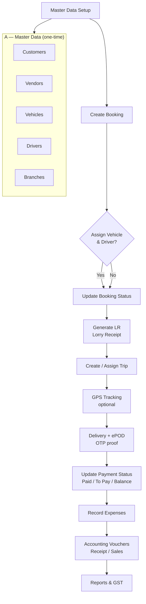

### 3.1 Booking Scenario

| Step | UI Path | API | Status flow |
|------|---------|-----|-------------|
| 1 | Bookings → Add New | `POST /api/bookings` | Pending |
| 2 | Booking Details → Edit | `PUT /api/bookings/{id}` | Confirmed / In Transit |
| 3 | Assign vehicle/driver | Same | Assigned |
| 4 | Complete delivery | Same | Delivered / Closed |

### 3.2 LR (Lorry Receipt) Scenario

| Step | UI Path | API |
|------|---------|-----|
| 1 | LR Management → Generate LR | `POST /api/lr/generate` |
| 2 | LR List → View / Print | `GET /api/lr` |
| 3 | Print LR format | Frontend print component |

### 3.3 Trip & Operations Scenario

| Step | UI Path | API |
|------|---------|-----|
| 1 | Operations → Trips | `GET/POST /api/trips` |
| 2 | Add stops, assign vehicle | Trip workflow |
| 3 | Operations → Route Optimizer | `POST /api/routing/optimize` |
| 4 | Operations → Shipments | `GET/POST /api/shipments` |

### 3.4 ePOD Scenario

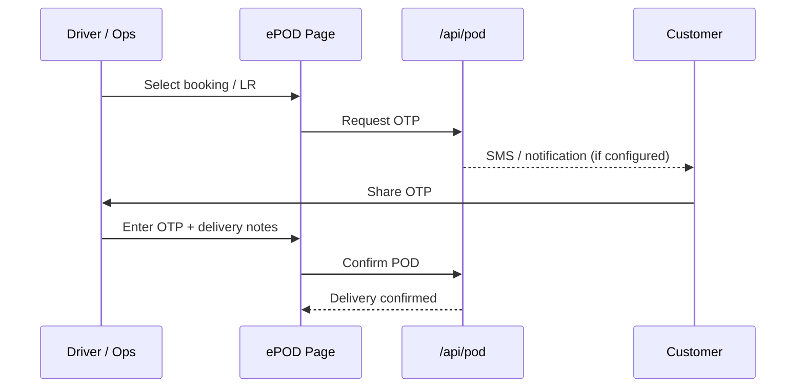

---

## 4. Fleet & GPS Workflows

### 4.1 Live GPS Tracking

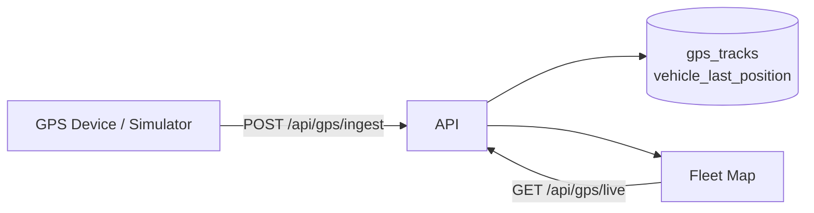

### 4.2 Geofence Alerts

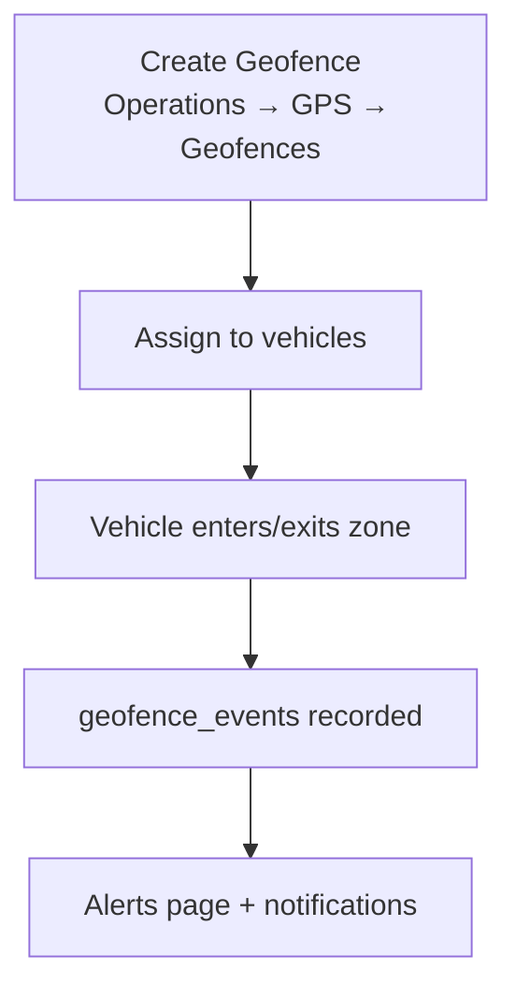

### 4.3 Predictive Maintenance

| Step | Action |
|------|--------|
| 1 | `npm run maintenance:install` — DB schema |
| 2 | Maintenance page — schedules per vehicle |
| 3 | Record service / breakdown |
| 4 | Alerts when due odometer/date reached |

---

## 5. HR Workflow (All Scenarios)

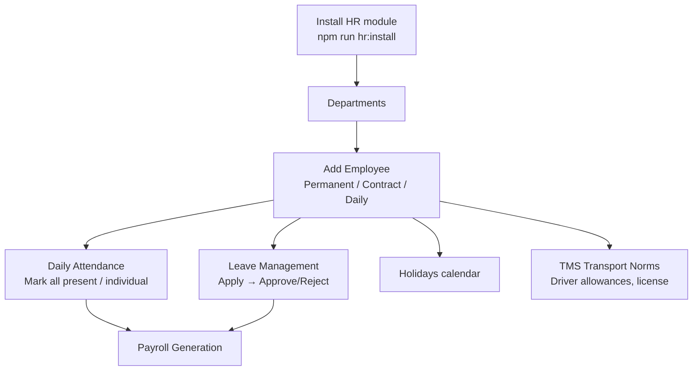

| Scenario | UI | API |
|----------|-----|-----|
| New employee | HR → Employees → Add | `POST /api/hr/employees` |
| Edit driver with fleet fields | Employee form (TMS section) | `sp_hr_save_employee` |
| Mark attendance | HR → Attendance | `GET/POST /api/hr/attendance` |
| Bulk present | Mark All Active Present | `POST /api/hr/attendance/bulk` |
| Apply leave | HR → Leave → Apply | `POST /api/hr/leaves` |
| Approve leave | Pending list → Approve | `POST /api/hr/leaves/{id}/approve` |

---

## 6. Payroll Workflow (All Scenarios)

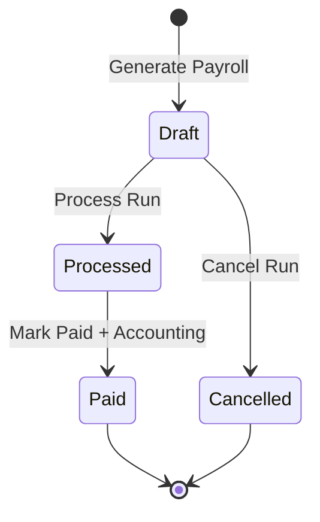

| Step | UI | API | Notes |
|------|-----|-----|-------|
| 1 Configure | Payroll → Settings | `GET/PUT /api/payroll/settings` | PF, ESI, trip bonus, etc. |
| 2 Generate | Payroll → Generate | `POST /api/payroll/generate` | Month + year |
| 3 Review | Payroll Runs → Details | `GET /api/payroll/runs/{id}/entries` | Per-employee breakdown |
| 4 Process | Process button | `POST /api/payroll/runs/{id}/process` | Locks calculations |
| 5 Pay | Mark Paid | `POST /api/payroll/runs/{id}/pay` | Posts accounting voucher |
| 6 Payslip | Payslips → Print | `GET /api/payroll/payslips/{id}` | PDF/print |
| 7 Register | Salary Register | `GET /api/payroll/salary-register` | Export/report |

**Employment types in payroll calculation:**
- **Permanent** — full monthly salary, PF, ESI, insurance
- **Contract** — contract amount, reduced allowances
- **Daily** — daily wage × attendance days

---

## 7. Accounting Workflow

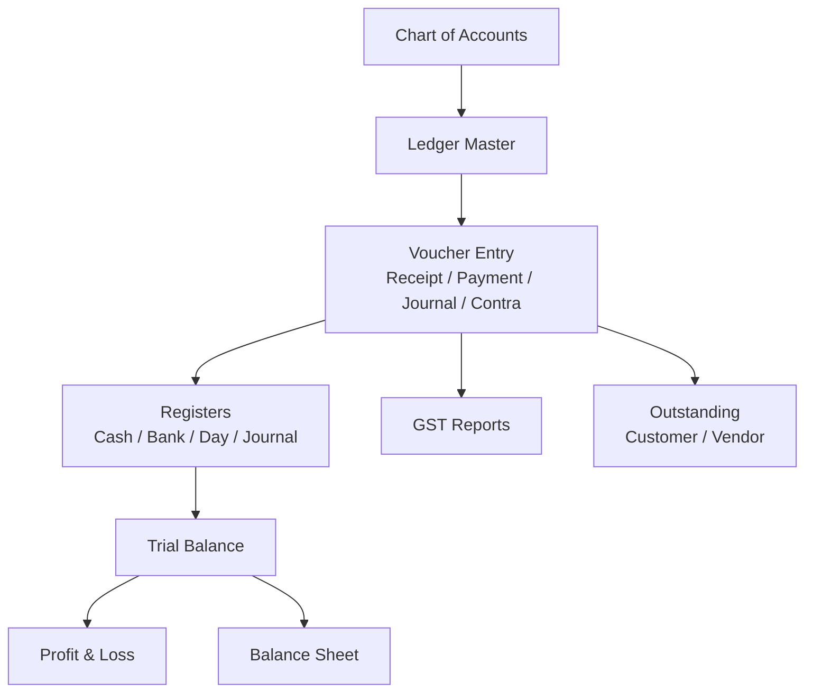

| Voucher type | Use case |
|--------------|----------|
| Receipt | Customer freight payment |
| Payment | Vendor / driver / expense payment |
| Journal | Adjustments, payroll accrual |
| Contra | Cash ↔ Bank transfer |
| Sales | Freight invoice posting |
| Purchase | Vendor bills |

**Payroll integration:** Mark Paid on payroll run auto-creates accounting voucher.

---

## 8. Expense Workflow

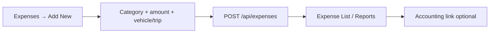

---

## 9. Customer Portal Workflow

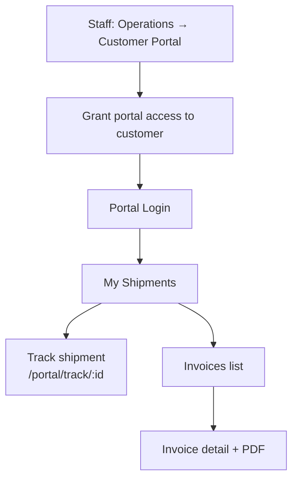

---

## 10. Notifications Workflow

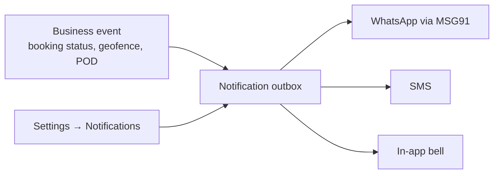

---

## 11. Multi-Branch Scenario

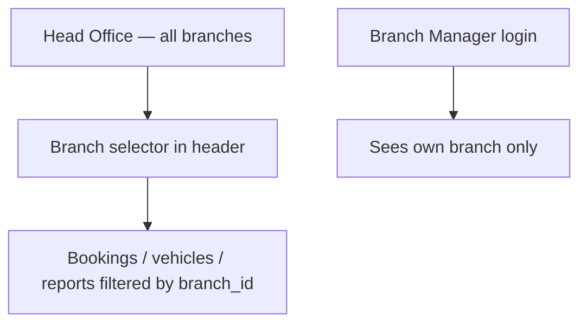

Install: `npm run branches:install`

---

## 12. Reports Workflow

| Report | Path | Data source |
|--------|------|-------------|
| Trip report | `/reports/trips` | trips + bookings |
| Vehicle utilization | `/reports/vehicles` | vehicles + GPS |
| Driver performance | `/reports/drivers` | drivers + trips |
| Income / expense | `/reports/income`, `/reports/expenses` | accounting |
| Cash flow | `/reports/cash-flow` | vouchers |
| Dashboard analytics | `/` (Dashboard tabs) | aggregated KPIs |

---

## 13. Deployment & Install Scenarios

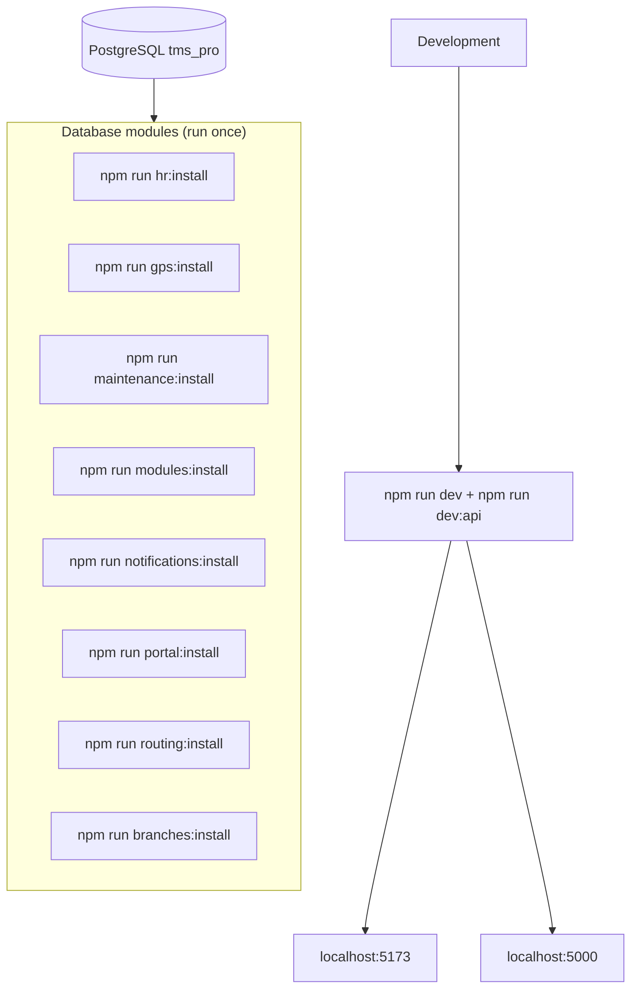

### Environment variables (Production)

| Variable | Purpose |
|----------|---------|
| `TMS_CONNECTION_STRING` | PostgreSQL connection |
| `TMS_JWT_KEY` | JWT signing (32+ chars) |
| `ASPNETCORE_ENVIRONMENT` | `Production` |
| `PGPASSWORD` / `TMS_PG_PASSWORD` | For install scripts |

---

## 14. Typical Day-in-Life Scenarios

### Scenario A — New freight booking (Operations)

1. Login → Dashboard
2. Customers (verify exists) → Bookings → New Booking
3. Fill consignor, consignee, route, freight, payment type
4. Save → Generate LR → Print for driver
5. Operations → Trips → assign vehicle
6. Fleet map → monitor movement
7. ePOD on delivery → update payment status

### Scenario B — Month-end payroll (HR + Accounts)

1. HR → Attendance → mark month / bulk present
2. HR → Leave → approve pending requests
3. Payroll → Settings → verify PF/ESI rates
4. Payroll → Generate → select month/year
5. Review run → Process → Mark Paid
6. Accounting → verify voucher posted
7. Payslips → distribute to employees

### Scenario C — Customer tracks shipment

1. Staff grants portal access (Settings → Portal Users)
2. Customer logs in at `/portal/login`
3. Views shipment list → opens track page
4. Optional: receives SMS on status change

### Scenario D — Vehicle maintenance due

1. Maintenance page → view due schedules
2. Record service when completed
3. Update odometer on vehicle master
4. Dashboard alerts if overdue

---

## 15. API Health Check

```
GET /api/health
→ { "status": "healthy", "service": "TMS Pro API", "database": "connected" }
```

---

## 16. Module Dependency Map

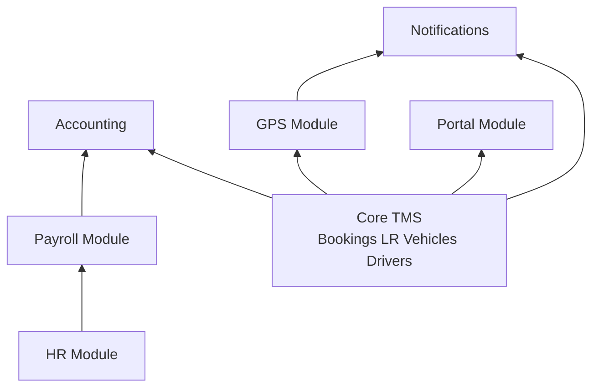

---

*Generated for TMS Pro — Enterprise Transport Management · India*
*Powered by [Codeestack](https://codeestack.vercel.app)*
